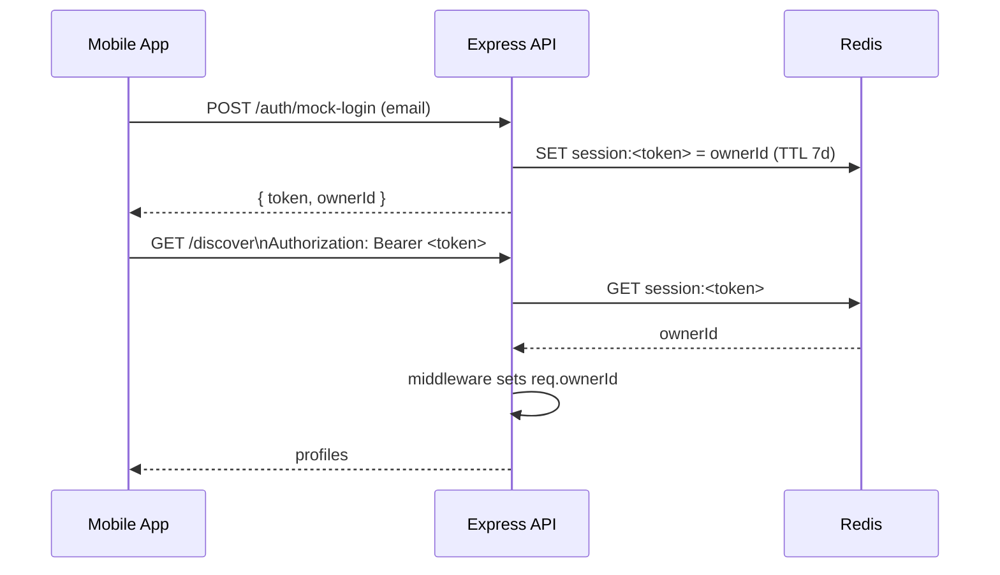
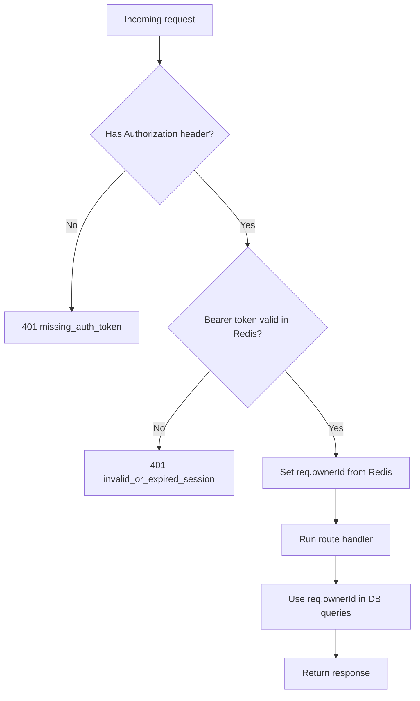

# Auth & Session Flow (Simple Explanation)

This document explains how authentication currently works in Share the Paws local API.

---

## TL;DR

- Client logs in at `POST /auth/mock-login`
- Server returns a session token
- Client sends token in `Authorization: Bearer <token>`
- Auth middleware validates token in Redis
- Middleware sets `req.ownerId`
- Protected routes use `req.ownerId` (not client-provided ownerId)

---

## Why this exists

Without this flow, a client could send any `ownerId` in request JSON and impersonate another user.

With this flow, identity is derived by the server from the session token stored in Redis.

---

## Sequence Diagram

---

## Request Lifecycle for Protected Routes

---

## Middleware behavior

The auth middleware does three things:

1. Parse `Authorization` header
2. Validate token against Redis session store
3. Attach `req.ownerId` for downstream handlers

If validation fails, request stops with `401`.

---

## Protected endpoints (current)

These endpoints require Bearer auth and rely on `req.ownerId`:

- `GET /me/profile`
- `POST /me/profile`
- `GET /discover`
- `POST /swipe`
- `GET /chats`
- `GET /chat/messages`
- `POST /chat/messages`
- `POST /chat/read`
- `POST /admin/generate-fake-profiles`
- `POST /admin/reset-fake-profiles`

---

## Important security rule

Do **not** trust client-submitted `ownerId` for protected operations.

Correct pattern:

- derive owner identity from token in middleware
- use `req.ownerId` everywhere

---

## Practical troubleshooting

If you see `missing_auth_token`:

- app did not set token after login, or
- request was sent before login, or
- request path is protected but client used plain `fetch` without auth wrapper

If you see `invalid_or_expired_session`:

- Redis was restarted (sessions gone), or
- token expired, or
- stale token in app

Fix: login again and retry.
